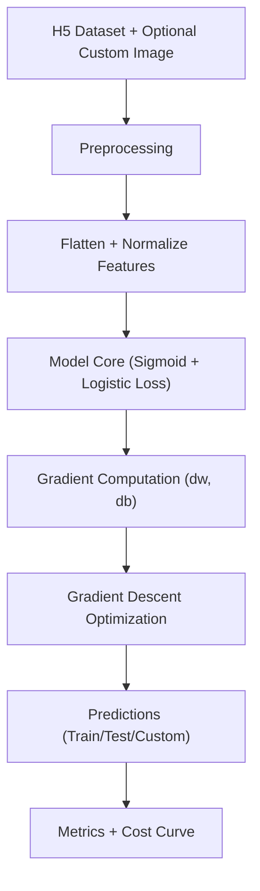

# Neural Network Logistic Regression for Cat vs Non-Cat Classification

## 1. Overview
This project implements an end-to-end binary image classifier using logistic regression from first principles in NumPy. The system loads H5 datasets, reshapes RGB images into feature vectors, trains parameters with gradient descent, and predicts whether an input image contains a cat.

The core problem addressed is transparent, math-first supervised classification. Instead of relying on high-level ML frameworks, this implementation exposes the optimization pipeline directly, which is useful for understanding how modern AI/ML systems are built on numerical computation, vectorized linear algebra, and iterative training loops.

## 2. Features
- Pure NumPy implementation of logistic regression (no high-level ML framework dependency)
- Full training pipeline: initialization, forward pass, cost computation, gradients, optimization, and inference
- Data loading from `.h5` files for train/test splits
- Unit-style public tests for each core function (`sigmoid`, `propagate`, `optimize`, `predict`, `model`)
- Image preprocessing flow for custom inference input
- Cost tracking for learning-curve visualization

## 3. Tech Stack
- Python
- NumPy
- SciPy
- h5py
- Pillow (PIL)
- Matplotlib

## 4. Architecture / Workflow


High-level flow:
1. Load train/test image tensors and labels.
2. Flatten each image into a vector and normalize pixel values.
3. Run logistic regression forward pass (`A = sigmoid(w^T X + b)`).
4. Compute binary cross-entropy cost and gradients.
5. Update parameters iteratively with gradient descent.
6. Generate predictions and evaluate accuracy.

## 5. Project Structure
```text
Neural-Network-Logistic-Regression/
|- vectorization.py      # End-to-end training and inference pipeline
|- lr_utils.py           # Dataset loading utilities (.h5)
|- public_tests.py       # Functional correctness tests for model components
|- README.md             # Project documentation
|- datasets/             # Expected runtime data location (not committed here)
|  |- train_catvnoncat.h5
|  `- test_catvnoncat.h5
`- images/               # Optional custom inference images (not committed here)
```

## 6. Installation
```bash
git clone https://github.com/<your-username>/Neural-Network-Logistic-Regression.git
cd Neural-Network-Logistic-Regression
python -m venv .venv
source .venv/bin/activate  # Windows: .venv\Scripts\activate
pip install numpy scipy h5py pillow matplotlib
```

## 7. Usage
### Run the training and evaluation pipeline
```bash
python vectorization.py
```

### Expected runtime assets
- `datasets/train_catvnoncat.h5`
- `datasets/test_catvnoncat.h5`
- Optional: `images/my_image.jpg` for custom inference

### Key outputs
- Dataset shape and dimensionality summary
- Train and test accuracy
- Cost history (every 100 iterations)
- Learning curve plot

## 8. Example Output
Representative console output format:
```text
Number of training examples: m_train = ...
Number of testing examples: m_test = ...
Height/Width of each image: num_px = ...
train accuracy: ... %
test accuracy: ... %
Cost after iteration 0: ...
Cost after iteration 100: ...
...
```

## 9. Engineering Insights
- Vectorization over loops: Matrix operations reduce Python-level overhead and reflect production ML compute patterns.
- Function-level decomposition: `sigmoid`, `propagate`, `optimize`, and `predict` isolate responsibilities and simplify testing.
- Deterministic verification: `public_tests.py` enforces expected behavior for gradients, costs, and shapes.
- Trade-off made: This implementation favors pedagogical clarity and mathematical transparency over framework-level scalability.
- Performance perspective: For larger image corpora or higher-dimensional feature spaces, mini-batching, hardware acceleration, and compiled backends would be necessary.
- Scalability direction: The current structure can evolve into a service-oriented training/inference pipeline with modular data loaders, experiment tracking, and model versioning.

## 10. Academic Context & Foundations
Transcript-backed context:
- Degree: Master of Science, Mechanical Engineering
- Institution: Worcester Polytechnic Institute
- Completion date: May 20, 2021
- Coursework window: Fall 2019 to Spring 2021

This project reflects how that graduate foundation transfers directly into AI/ML engineering.

### Course-to-project mapping
- ME 5001: APPLD NUMERICL METHDS IN ENGIN (Spring 2020)
  - Learned: iterative numerical methods, convergence behavior, and algorithmic approximation.
  - Applied here: gradient descent optimization loop, learning-rate sensitivity, and iterative loss minimization.

- MA 501: ENGINEERING MATHEMATICS (Fall 2020)
  - Learned: linear algebra, multivariable calculus, and mathematical modeling.
  - Applied here: vectorized logistic regression formulation, gradient computation, and matrix-based implementation.

- ME 5220: CNTRL OF LINEAR DYNAMCL SYSTMS (Fall 2019)
  - Learned: feedback behavior, stability reasoning, and system response analysis.
  - Applied here: training as a feedback process where gradients repeatedly correct parameters toward stable minima.

- ME 501: ROBOT DYNAMICS (Fall 2020)
  - Learned: model-based state reasoning and dynamics-driven system formulation.
  - Applied here: disciplined decomposition of the ML pipeline into components with explicit inputs, transformations, and outputs.

- ME 5108: INTRO COMPUT FLUID DYNAMICS (Spring 2020)
  - Learned: numerical simulation workflows and computational trade-offs.
  - Applied here: simulation-oriented thinking for data preprocessing, numerical optimization, and compute-aware implementation choices.

- ME 5303: APPLD FINITE ELEM MTHDS IN ENG (Spring 2021)
  - Learned: matrix-centric computational modeling and problem decomposition.
  - Applied here: modular model construction and reliance on efficient linear algebra operations.

- ISG BJS 05: TUMOR ABLATION MODELING (Fall 2019)
  - Learned: mathematically grounded modeling of real-world systems under constraints.
  - Applied here: evidence-driven evaluation mindset via measurable metrics (cost trend, train/test accuracy).

### Timeline narrative (2019-2021 -> AI/ML execution)
These concepts were developed during my Master's from Fall 2019 through Spring 2021, before my formal AI/ML transition. Even though this classifier was implemented later, its core mechanics are built on that earlier training in mathematical modeling, numerical computation, and system-level engineering.

I was working with mathematical modeling, numerical methods, and system-level thinking during my Master's, which later translated naturally into AI/ML system design.

Even before formally transitioning into AI/ML, I was already working with core principles like optimization, numerical computation, and system modeling, which are fundamental to modern machine learning.

### AI/ML positioning
- Mathematical thinking -> strong ML fundamentals (optimization, gradients, matrix calculus)
- Computational modeling -> reliable ML pipeline design (data transformation, iterative training, evaluation)
- Engineering mindset -> scalable AI systems (modularity, testability, measurable outcomes)

## 11. Challenges & Learnings
- Challenge: translating mathematical equations into shape-safe NumPy code.
  - Learning: strict attention to tensor dimensions and broadcasting is critical for correctness.
- Challenge: balancing readability with vectorized performance.
  - Learning: clear function boundaries plus matrix operations provide both maintainability and speed.
- Challenge: validating each stage of training logic.
  - Learning: small deterministic tests catch gradient and cost bugs early.

## 12. Future Improvements
- Refactor training/inference into a package layout (`src/`, `models/`, `api/`) for cleaner production extensibility.
- Add configuration management (YAML/CLI flags) for hyperparameters and reproducible runs.
- Integrate experiment tracking (metrics, artifacts, run metadata).
- Add regularization and mini-batch training for better generalization and scalability.
- Extend from logistic regression baseline to deep neural architectures while preserving test discipline.
- Containerize execution and add CI for automated validation on every commit.
