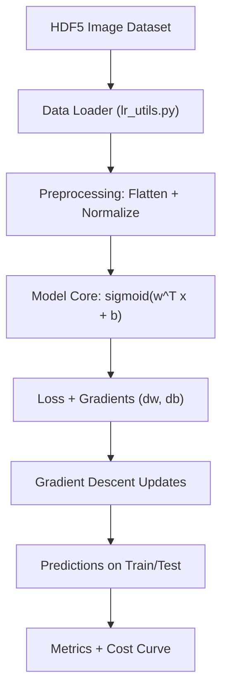

# Neural Network Logistic Regression: Cat vs Non-Cat Classifier

## 1. Overview
This project implements a binary image classifier using logistic regression from first principles in NumPy. It loads image data from HDF5 files, performs vectorized preprocessing, trains model parameters with gradient descent, and predicts whether an image contains a cat.

The problem it solves is foundational: understanding how supervised learning systems are built at the level of math, data flow, and numerical optimization. This matters because production AI/ML engineering depends on these same primitives, even when higher-level frameworks abstract them.

## 2. Features
- End-to-end binary classification pipeline implemented in Python + NumPy
- Dataset ingestion from HDF5 (`train_catvnoncat.h5`, `test_catvnoncat.h5`)
- Vectorized flattening and normalization for RGB image tensors
- Logistic regression core: sigmoid activation, cross-entropy loss, gradient computation
- Gradient descent optimizer with configurable learning rate and iteration count
- Train/test prediction and accuracy reporting
- Cost history capture for learning-curve visualization
- Function-level correctness checks via `public_tests.py`

## 3. Tech Stack
- Python 3
- NumPy
- h5py
- Matplotlib
- Pillow (PIL)
- SciPy

## 4. Architecture / Workflow


## 5. Project Structure
```text
Neural-Network-Logistic-Regression/
├── vectorization.py   # Main implementation and execution flow
├── lr_utils.py        # HDF5 dataset loading utility
├── public_tests.py    # Unit-style validation for core functions
└── README.md          # Project documentation
```

Expected runtime assets (not committed in this repo):
```text
datasets/
├── train_catvnoncat.h5
└── test_catvnoncat.h5

images/
└── my_image.jpg       # Optional custom inference image
```

## 6. Installation
```bash
git clone https://github.com/<your-username>/Neural-Network-Logistic-Regression.git
cd Neural-Network-Logistic-Regression
python -m venv .venv
source .venv/bin/activate  # Windows: .venv\Scripts\activate
pip install numpy h5py matplotlib pillow scipy
```

## 7. Usage
1. Place dataset files under `datasets/`:
   - `datasets/train_catvnoncat.h5`
   - `datasets/test_catvnoncat.h5`
2. (Optional) Place a custom image at `images/my_image.jpg`
3. Run:

```bash
python vectorization.py
```

The script executes:
- data loading and preprocessing
- core function validation (`sigmoid`, `propagate`, `optimize`, `predict`, `model`)
- model training and evaluation
- cost plotting

## 8. Example Output
Representative console output:
```text
Number of training examples: m_train = ...
Number of testing examples: m_test = ...
Height/Width of each image: num_px = ...
train accuracy: ... %
test accuracy: ... %
Cost after iteration 0: ...
Cost after iteration 100: ...
...
```

## 9. Engineering Insights
- Vectorization first: matrix operations reduce Python-loop overhead and match ML compute patterns used in larger systems.
- Modular decomposition: separate functions (`sigmoid`, `propagate`, `optimize`, `predict`, `model`) improve maintainability and testability.
- Numerical correctness discipline: `public_tests.py` validates shape, value, and gradient behavior across critical components.
- Trade-off: this code favors algorithmic transparency over production packaging (single-script flow vs modular package).
- Performance note: full-batch gradient descent is clear and deterministic, but mini-batching is better for larger datasets.
- Scalability direction: promote model/data/training code into separate modules, then add experiment tracking and model versioning.

## 10. Learning Journey & AI/ML Foundations

### A. Computational & Mathematical Foundations
My engineering background is rooted in computational and mathematical problem solving:
- Mathematical modeling of real systems
- Numerical methods for iterative solution finding
- Algorithmic thinking for decomposition and optimization
- Matrix-centric computation aligned with NumPy-style vectorization
- Structured data handling that maps naturally to DataFrame-style workflows

These are the same foundations that power modern ML training loops and model evaluation pipelines.

### B. Current Academic Direction
I am currently pursuing an M.Tech in AI/ML. My academic trajectory is focused on:
- Machine Learning
- Deep Learning
- Natural Language Processing
- AI Systems Engineering

### C. Self-Driven Learning Narrative
This project is part of my self-driven transition into AI/ML engineering. I intentionally build implementation-first projects to strengthen fundamentals and move from theory to deployable systems thinking. Beyond model equations, I focus on pipeline behavior, numerical stability, and software quality.

### D. Project -> AI/ML Mapping
- Logistic regression training loop -> core ML optimization mechanics
- Vectorized preprocessing -> feature engineering and tensor pipeline discipline
- Cost tracking across iterations -> convergence monitoring and experiment analysis
- Function-level tests -> reliability practices used in production ML systems
- End-to-end flow (data -> model -> metrics) -> backbone of real AI engineering pipelines

### E. Narrative Positioning
This project is part of my transition into AI/ML, where I apply strong foundations in computational modeling and numerical methods to build scalable and intelligent systems.

### F. Core Insight
Even before specializing in AI/ML, I was working with computational algorithms, numerical methods, and system modeling, which form the backbone of modern machine learning systems.

## 11. Challenges & Learnings
- Converting equations to shape-safe NumPy code reinforced disciplined handling of dimensions and broadcasting.
- Designing reusable functions clarified interface boundaries between math logic and execution flow.
- Verifying optimization behavior showed the value of small deterministic tests for catching subtle bugs early.
- Working with script-order dependencies highlighted the need for cleaner orchestration and production-grade structure.

## 12. Future Improvements
- Refactor into a package layout (`src/`, `models/`, `api/`) for clearer separation of concerns.
- Add CLI/config-driven hyperparameter management.
- Introduce mini-batch training and regularization options.
- Add experiment tracking (metrics, artifacts, run metadata).
- Expose inference via a lightweight API service.
- Integrate CI to run tests automatically on each change.

